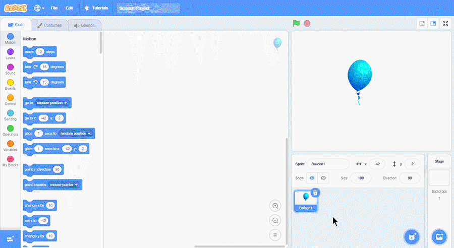

## Sprite Awal
Sprite awal saat Scratch pertama kali dibuka adalah karakter kucing.

{}
Sprite awal tersebut merupakan maskot dari aplikasi Scratch.
{}

## Menghapus Sprite
Pada Sprite Pane, terdapat ikon tong sampah untuk menghapus sprite.

## Menambahkan Sprite
Jika kita ingin menambahkan sprite baru, klik ikon kucing pada Sprite Pane.

## Menambahkan Background
Selain menambahkan sprite, kita juga dapat menambahkan background. Background dapat ditambahkan pada sprite pane sesuai.

